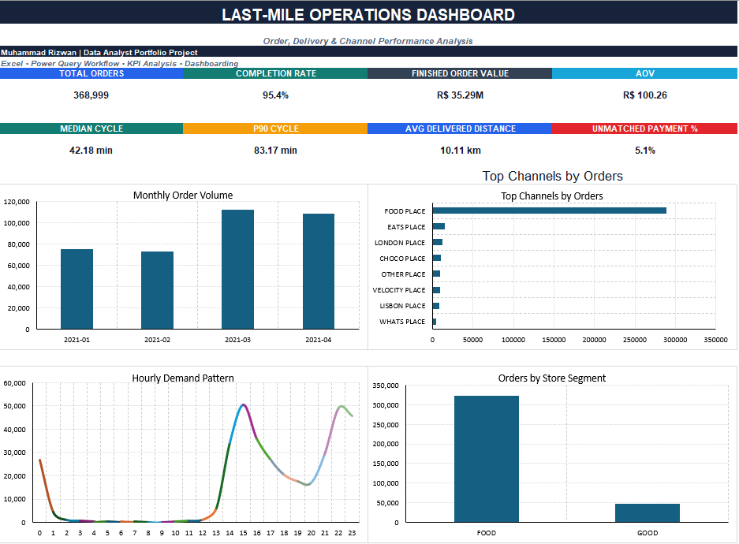

# Last-Mile Operations Analytics

## Project overview

This project analyzes last-mile delivery operations in Excel using seven source files covering orders, payments, deliveries, stores, channels, drivers and hubs.

The main goal was to understand order volume, completion, order value, delivery cycle time and operational data quality while keeping the analysis at one row per order.

## Tools used

- Microsoft Excel
- Power Query workflow and M code
- PivotTable-style summary analysis
- Data validation and QA checks
- Dashboard design

## Dataset

The analysis covers **368,999 orders** from January to April 2021.

The source data includes:

- Orders
- Payments
- Deliveries
- Stores
- Channels
- Drivers
- Hubs

## Data preparation

A major part of the project was protecting the grain of the Orders table.

Two source tables required special handling:

- **Payments:** some orders had multiple payment rows, so payments were aggregated to one row per `payment_order_id` before joining.
- **Deliveries:** some orders had multiple delivery attempts, so a repeatable final-attempt rule was applied before joining to Orders.

I also checked duplicate keys, unmatched joins, negative duration values and extreme cycle-time records before using the results in the dashboard.

## Key KPIs

| KPI | Result |
| --- | ---: |
| Total Orders | 368,999 |
| Completion Rate | 95.4% |
| Finished Order Value | R$ 35.29M |
| Average Order Value | R$ 100.26 |
| Median Cycle Time | 42.18 min |
| P90 Cycle Time | 83.17 min |
| Average Delivered Distance | 10.11 km |
| Unmatched Payment Rate | 5.1% |

## Dashboard

The dashboard focuses on:

- Monthly order volume
- Channel concentration
- Hourly demand pattern
- Store-segment order mix
- Delivery-cycle performance
- Payment coverage

## Key findings

- 352,020 of 368,999 orders finished, giving a 95.4% completion rate.
- March had the highest monthly order volume with 112,223 orders.
- FOOD PLACE accounted for the majority of channel volume.
- Median cycle time was 42.18 minutes, while P90 was 83.17 minutes.
- The large gap between median and mean cycle time showed that the distribution contains extreme outliers.
- 18,665 orders did not match a payment record and 10,345 did not match a delivery record, so missing joins were kept visible rather than treated as zero.

## Workbook structure

The Excel workbook includes:

- Project overview
- Source audit
- Data dictionary
- Power Query build steps
- M code library
- Model design
- Fact-table sample
- KPI definitions
- Report build steps
- Validated summary tables
- Dashboard
- Key findings
- QA checklist
- Modeling notes

## Portfolio note

This repository contains a compact portfolio workbook. The full seven-file dataset was analyzed, but external CSV connections are not embedded in the shared workbook. The transformation workflow and M code are documented inside the workbook, and the dashboard uses validated full-data summary outputs.

## Author

**Muhammad Rizwan**  
Data Analyst Portfolio Project
